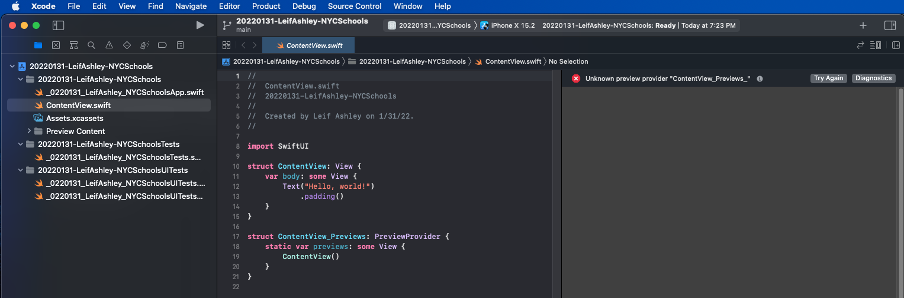
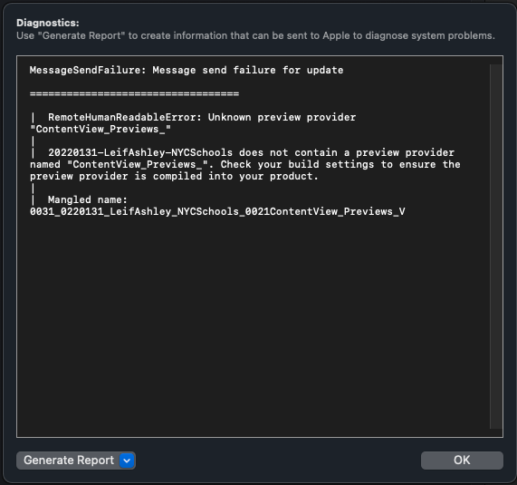

# JPMC-20220131-LeifAshley-NYCSchools - iOS Coding test

<table align="left" style="width:90%%" border=0>
    <tr>
        <td style="min-width:50px"></td>
        <td style="width: 100%; vertical-align: text-center" >The original project name could not be used per the Coding Challenge assignment. Please see development issues below for more details. </td>
    </tr>
</table>

[Development Issues](#Issues-During-Development)

# Coding Challenge - NYC Schools

## Screenshots

TBD at a future time

## Features

- [x] Loads and caches data for the schools and sat scores to minimize network interaction
- [x] Loads, on demand, the full data set of schools data for the map and other items
- [x] Allows for searching for a school by any item in displayed in the view to the user
- [x] Details shows the SATs scores and the average scores for all the NYC schools
- [x] Phone, email, and web items for a school are tappable
- [x] SwiftUI Design makes heavy use of reusable and structured view elements

## Requirements
| Platform / Tool | Minimum Version | Status |
| --- | --- | --- |
| macOS Monterey (Intel) | 12.1 | Fully Tested |
| Xcode | 12.2.1 (13C100) | Fully Tested |
| Swift | 5 | Fully Tested |
| iOS | 15.2 | Fully Tested |

## Assignment

This is the link to the origina PDF coding assignment challenge for this project.

[Challenge PDF](./mdAssets/jpmcChallengeNYCSchools.pdf) 

## Scope & Motivations
The scope of this coding assessment was likely far smaller than what I did. The motivations for going above and beyond were many fold:
- **Full App Design**: this app is a intended to be a production ready (as much as it can be) app 
- **Demo Purposes**: it makes a nice showcase for anyone I talk to about app design.
- **Style & Design Guides**: I have many thoughts on these topics where I've never had a public venue to share them. Now I do.
- **Future Plans**: are to include elemtents for color themeing, localization, and light/dark themes

## How to Build & Run

## Assumpions & Given
- **soda-swift library**: looks out of date with minimal functionality
- **Using 2017 NYC DOE high school** directory date with 2012 SAT Results could result in data consistency issues, such as schools without results or results without schools

# Development Notes

## Testing (App Specific)
Test for this application was minimal but a solid baseline:
- Unit testing items were put into place for networking and other testable elements. Performance as a baseline was not tested.
- Simulator Testing was performed for the required iPhone X and also the latest iPhone 13 Pro
- Actual testing was performed using my personal iPhone Xs

---
## Tools Used

- **XCode 13.2.1** 
- **VisualStudio Code 1.62.2**: for GITHUB markdown
  - Extension: Markdown All in One 3.4.0
  - Extension: vscode-pdf
- **Sublime Build 4126** 
- **Google Chrome** 
  - Postman: JSON visualization
- ***Safari***: research

## Learned along the way
- Command line projects are good for testing & prepping core components outside the simulator and works better than a playground, i.e. has breakpoints
- Playgrounds have issues building rapidly components for use, specifically async/await are not fully supported. Also no way to breakpoint debug items.

## Issues During Development
- Starting in a blank project, the SwiftUI Preview was crashing (see images below). Project names cannot start with a number
- VStacks and other stacks only take 10 arguments, to accept more than that, they must be in a group or the project will not compile.
- State variables at a top level need to be set to respond to state changes. However in subviews used in a top level view, if state variables are used that match the ones used at the top level, combine sees these as different variables subviews will not be triggered for refresh. 

---
Project name crashes in the Preview Pane:

The problem is that Apple xcode SwiftUI Preview has issues when the project name starts with a number. From personal, experience it's still a bit temperamental and I've had to perform various xcode related fixes for problems that occur.

Stack Overflow has a page outlining it from other users.

[Stack Overflow: SwiftUI - Unknown preview provider "ContentView_Previews_" when previewing. Happens in a brand-new project](https://stackoverflow.com/questions/65873684/swiftui-unknown-preview-provider-contentview-previews-when-previewing-happ)

